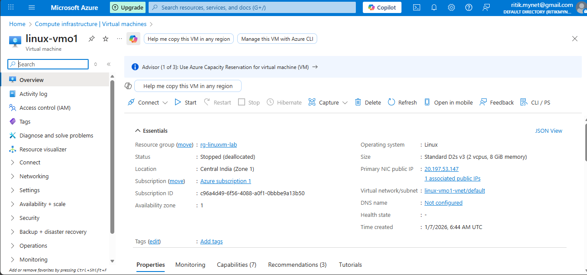
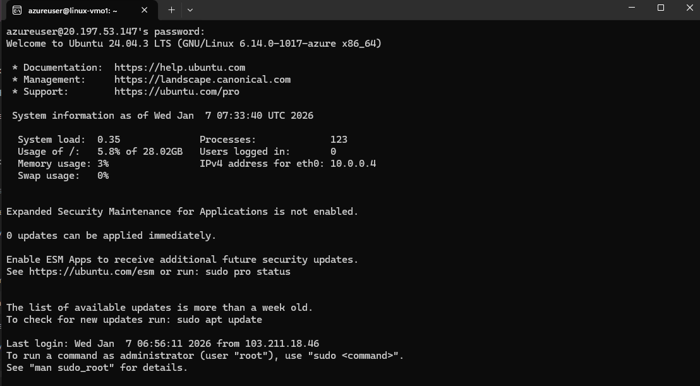
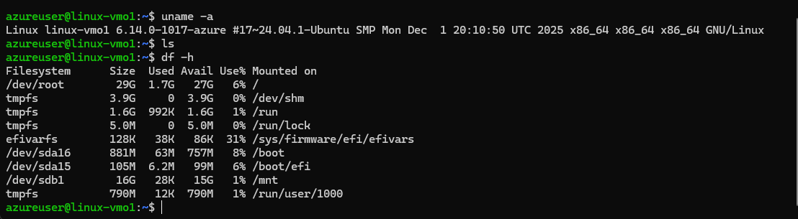
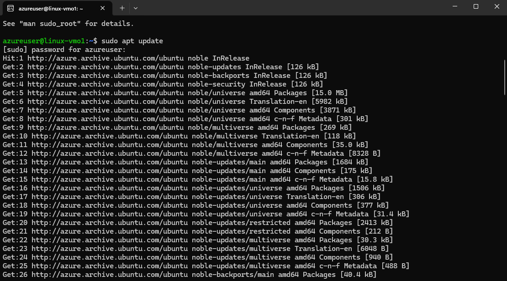
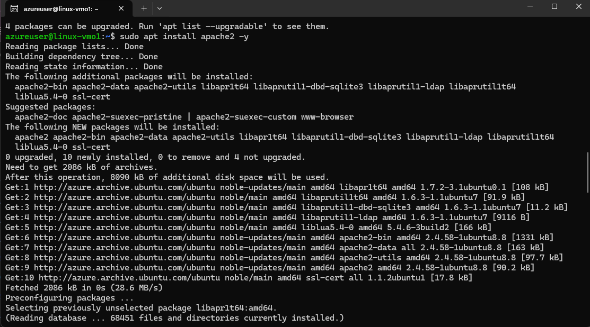
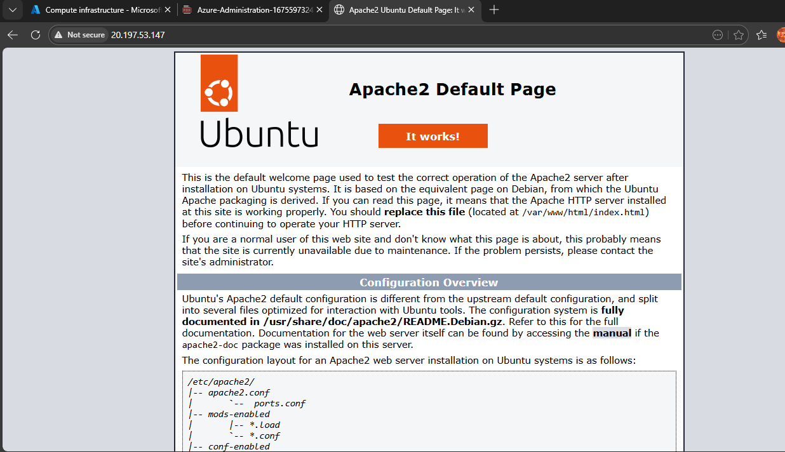

## 🧪 Lab Objective
- Create a Linux VM in Azure
- Connect securely using SSH
- Install and verify Apache Web Server
- Configure NSG inbound rules
- Test web access using Public IP

---

## 🔹 Step 1: Login to Azure Portal
Login to https://portal.azure.com

---

## 🔹 Step 2: Create Resource Group
- Name: `rg-linuxvm-lab`
- Region: `Central India`

---

## 🔹 Step 3: Create Virtual Machine
Search → Virtual Machines → Create → Azure Virtual Machine

📸 Screenshot  

---

## 🔹 Step 4: VM Basics Configuration

| Setting | Value |
|------|------|
| Subscription | Free Trial |
| Resource Group | rg-linuxvm-lab |
| VM Name | linux-vm01 |
| Region | Central India |
| Availability | No infrastructure redundancy |
| Image | Ubuntu Server 22.04 LTS |
| Size | Standard_B1s |
| Authentication | SSH Public Key |
| Username | azureuser |
| SSH Key | Generate new key pair |
| Key Pair Name | linux-vm-key |
| Inbound Port | SSH (22) |

---

## 🔹 Step 5: Disk Configuration
- OS Disk: Standard SSD
- Default settings

---

## 🔹 Step 6: Networking Configuration
- VNet: Auto-created
- Subnet: Default
- Public IP: New
- NSG: Basic
- Allowed Port: SSH (22)

---

## Step 7: NSG Inbound Rule for HTTP
Allow port 80 (HTTP) if Apache is not accessible.

📸 Screenshot  

---

## 🔐 Step 8: Download SSH Private Key
⚠️ Important: Key cannot be downloaded again.

---

## 🔑 Step 9: Connect to Linux VM via SSH
ssh -i <private-key-file-path> azureuser@20.197.53.147
OR
ssh azureuser@20.197.53.147 (in cmd/win+r)

📸 Screenshot  

---

## Step 10: Verify VM
- uname -a
- ls
- df -h

📸 Screenshot  

---

## Step 11:Install Apache Web Server
- sudo apt update
- sudo install Apache2 -y

📸 Screenshot  

---

📸 Screenshot  

---

## Step 13: Test Apache
Open Browser type (http://LinuxVM-PUBLIC-IP)

📸 Screenshot  

