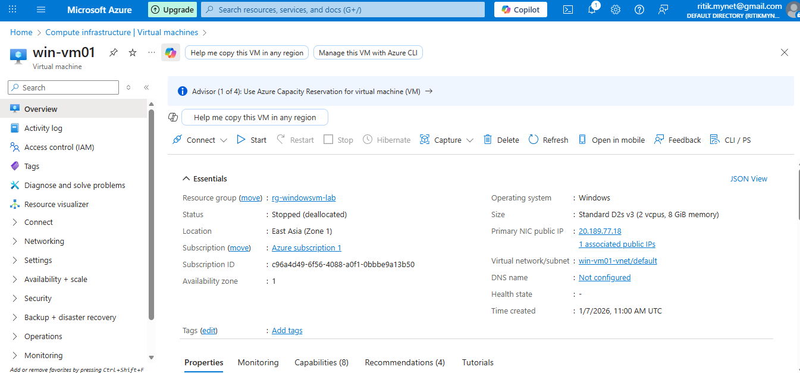
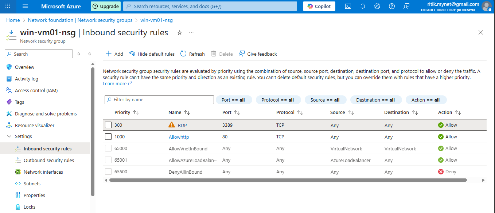
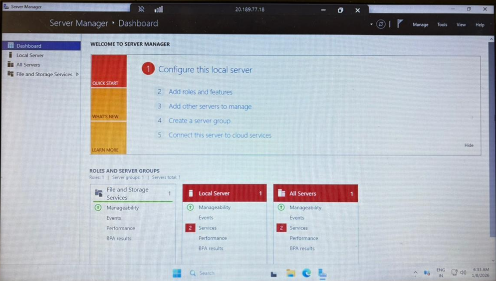
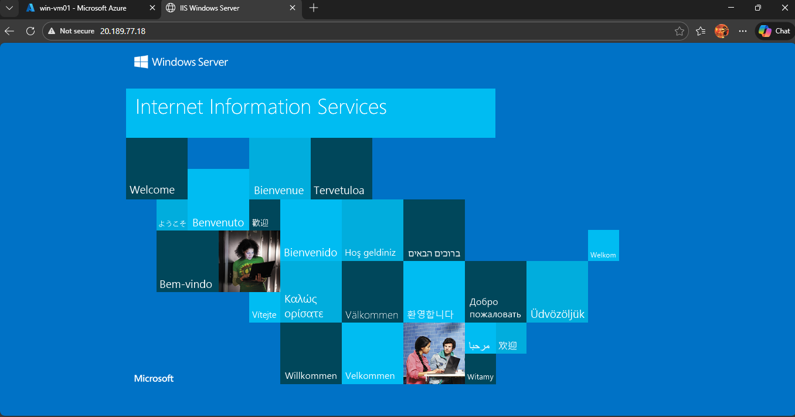

## 🧪 Lab Objective
- Create a Windows Virtual Machine in Azure
- Configure RDP access
- Install and configure IIS Web Server
- Configure Network Security Group (NSG) rules
- Access the IIS website from a local machine

---

## 🔹 Step 1: Login to Azure Portal
Login to https://portal.azure.com

---

## 🔹 Step 2: Create Resource Group
- Name: `rg-windowsxvm-lab`
- Region: `Central India`

---

## 🔹 Step 3: Create Virtual Machine
Search → Virtual Machines → Create → Azure Virtual Machine

📸 Screenshot  

---

## 🔹 Step 4: VM Basics Configuration

| Setting | Value |
|------|------|
| Subscription | Free Trial |
| Resource Group | rg-windowsxvm-lab |
| VM Name | win-vm01 |
| Region | Central India |
| Availability | No infrastructure redundancy |
| Image | Windows Server 2019 Datacenter (or 2025) |
| Size | Standard_B1s |
| Authentication | RDP |
| Username | azureuser |
| Key Pair Name | linux-vm-key |
| Inbound Port | RDP (3389) |

---

## 🔹 Step 5: Disk Configuration
- OS Disk: Standard SSD
- Default settings

---

## 🔹 Step 6: Networking Configuration
- VNet: Auto-created
- Subnet: Default
- Public IP: New
- NSG: Basic
- Allowed Port: RDP (3389)

---

## Step 7: NSG Inbound Rule for HTTP
Allow port 80 (HTTP) if IIS Server is not accessible.
Add an inbound rule:
- Port: `80`
- Protocol: TCP
- Source: Any
- Action: Allow

📸 Screenshot  

---

## 🔑 Step 9: Connect to Windows VM via RDP
- Download RDP file from Azure Portal
- Open RDP File
- Login using VM credentials from local PC by giving username and password

📸 Screenshot  

---

## Step 4: Install IIS Web Server
Inside the VM:
1. Open **Server Manager**
2. Add Roles and Features
3. Select **Web Server (IIS)**
4. Install and complete setup

📸 Screenshot  

---

## Step 13: Test IIS Server From Your Local PC
Open Browser type (http://WindowsVM-PUBLIC-IP)

📸 Screenshot  

