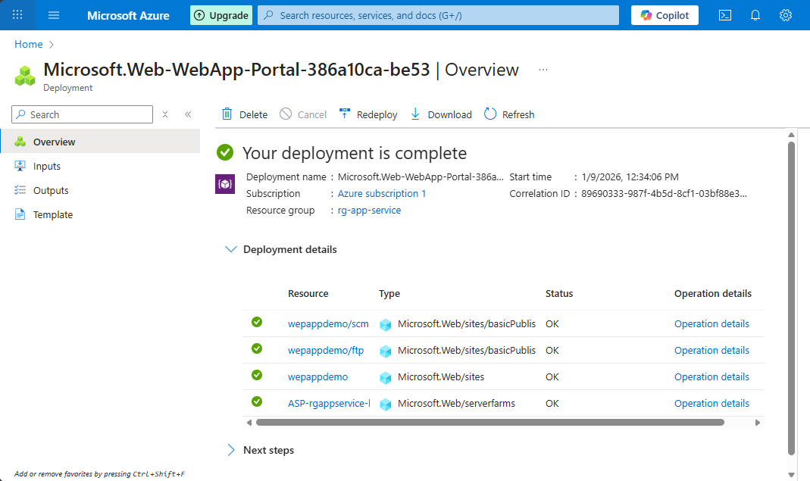
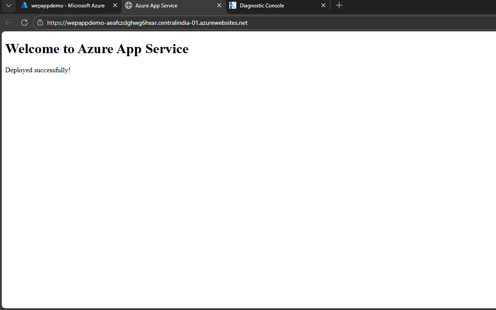

# 🚀 Deploy Web App using Azure App Service

---

## 🔹 Step 1: Create Resource Group
1. Azure Portal → Resource Groups
2. Click **+ Create**
3. Name: rg-app-service
4. Region: Central India
5. Click **Create**

---

## 🔹 Step 2: Create App Service
1. Azure Portal → Search **App Services**
2. Click **+ Create**
3. Fill details:
   - Subscription: Your subscription
   - Resource Group: rg-app-service
   - Web App Name: webappdemo1
   - Publish: Code
   - Runtime Stack: HTML / .NET / Node (any)
   - OS: Linux or Windows
   - Region: Central India
4. Click **Review + Create → Create**

📸 Screenshot  

---

## 🔹 Step 3: Upload Web App Code
1. Open created App Service
2. Go to **Deployment Center**
3. Select **Local Git / FTP**
4. Use **App Service Editor (Preview)** or
5. On left menu, scroll to Development Tools → Advanced Tools
6. Click Go → (this opens Kudu in a new tab)
7. In Kudu, click Debug Console → CMD
8. Navigate to: site → wwwroot
9. Upload or Create new `index.html`

---

## 🔹 Step 4: Test and Verify Web App
1.Copy the default domain from your created webappdemo app service
2. Go to your **Browse** on local PC and Search

📸 Screenshot  

---

## 🔹 Step 5: Stop App (Cost Saving)
- App Service → Overview → Stop
