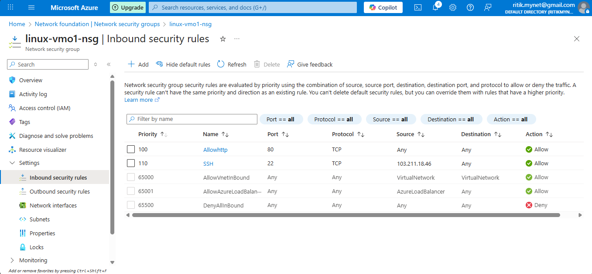
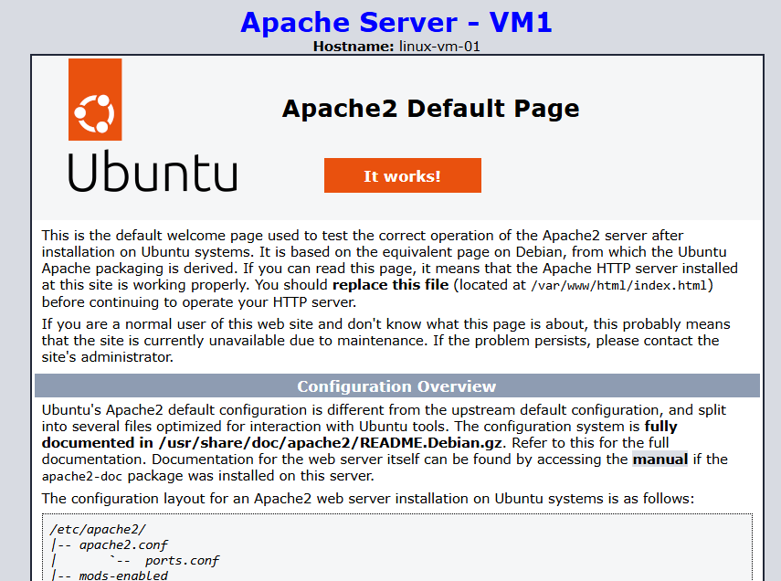
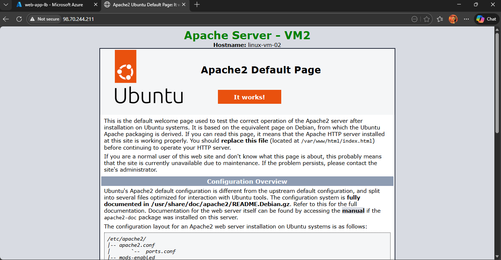

# 🚀 Azure Load Balancer Step-by-Step Configuration

---

## 🔹 Step 1: Create another Linux VM of the same configuration as 1 Linux VM 
1. Azure Portal → Virtual Machines → + Create
2. Use **same settings** as first VM:
   - Same Resource Group
   - Same VNet & Subnet
   - Same NSG
3. VM Name: `linux-vm-2`
4. Size: `Standard_B1s`
5. Create VM

---

## 🔹 Step 2: Configure the NSG Inbound Rules and Allowing Port:
1. HTTP (80)
2. SSH (22)

📸 Screenshot  

---

## 🔹 Step 3: Install Apache in the second VM
1. connect to linu vm by SSH through your loacal PC terminal/cmd
2. Install Apache:
   - sudo apt update
   - sudo apt install apache2 -y
3. check Apache Status:
   - sudo systemctl status apache2

---

## 🔹 Step 4: Edit Ubuntu Server Web Page
1. In linux Server navigate to: sudo nano /var/www/html/index.html
2. Press ctrl+w >> type <body> and Enter >> Your cursor will jump near html body part.
3. Edit the ubuntu page headline into Linux VM 02
4. Press ctrl+0 >> Enter(save) >> ctrl+x.

---

## 🔹 Step 5: Create Azure Load Balancer
1. Azure Portal >> Load Balancer >> +Create.
2. Configure Basic Details >> Add Frontend IP Configuration >> Add Backend IP Configuration
3. Go to Inbound rules >> Add a load balancing rule
4. Review + Create >> Create

---

## 🔹 Step 6: Testing Azure Load Balancing
1. Copy the Public IP of created load balancer
2. Open browser >> Paste Public IP
3. 🔁 Refresh multiple times.
4. You will see:
- Apache Server –Linux VM1 (blue)
- then Apache Server –Linux VM2 (green)

🎉 This proves load balancing is working

---

📸 Screenshot  

---

📸 Screenshot  

